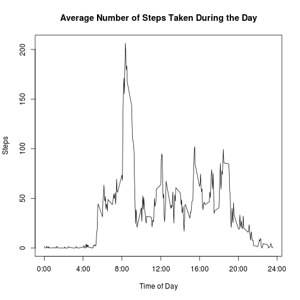
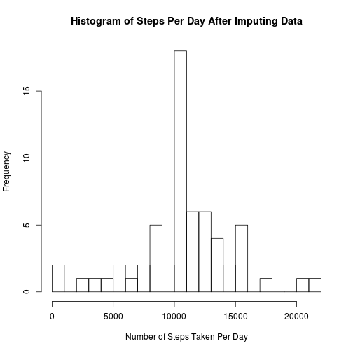
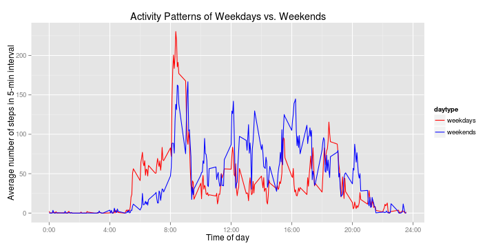

## Loading and preprocessing the data

### Load data

```r
unzip('activity.zip')
suppressMessages(library(data.table))
dat <- fread('activity.csv', header=TRUE)
```

### Transform data

```r
suppressMessages(library(dplyr))
dat <- mutate(dat, date=as.POSIXct(date))
```


## What is mean total number of steps taken per day?
### Total number of steps taken per day

```r
dat1 <- dat[!is.na(dat$steps),]
steps_per_day <- aggregate(select(dat1, steps),
                            by=list(date=dat1$date), FUN=sum)
hist(steps_per_day$steps, breaks=20,
        main='Histogram of number of Steps per Day',
        xlab='Number of steps taken per day',
        ylab='Frequency')
```

 

### Mean of the total number of steps taken per day

```r
mean(steps_per_day$steps)
```

```
## [1] 10766.19
```

### Median of the total number of steps taken per day

```r
median(steps_per_day$steps)
```

```
## [1] 10765
```


## What is the average daily activity pattern?

### Average number of steps taken every interval, averaged across all days

```r
avgsteps_per_interval <- aggregate(select(dat1, steps),
                                    by=list(interval=dat1$interval), FUN=mean)
plot(avgsteps_per_interval$steps ~ avgsteps_per_interval$interval, type='l',
        main='Average Number of Steps Taken During the Day',
        ylab='Steps', xlab='Time of Day', xaxt='n')
axis(1, at=(0:6*4)*100, labels=paste(0:6*4, ':00', sep=''))
```

 

### Which 5-min interval on average across all the days contains the maximum number of steps?

```r
max_interval <- avgsteps_per_interval$interval[
                    which.max(avgsteps_per_interval$steps)]
max_interval 
```

```
## [1] 835
```

### At what time?

```r
sprintf('%02d:%02d', floor(max_interval/100), max_interval%%100*0.6)
```

```
## [1] "08:21"
```


## Imputing missing values
### Calculate and report the total number of missing values in the dataset

```r
sum(is.na(dat))
```

```
## [1] 2304
```

### Fill in all of the missing values in the dataset using the mean for that 5-min interval to make the daily pattern of this people consistent over multiple days

```r
filled_dat <- mutate(dat, steps=ifelse(is.na(steps),
    avgsteps_per_interval$steps, # this is being recycling to have the 
                                 # same length with filled_dat
    steps))
```

### Make a histogram of the total number of steps taken each day

```r
new_steps_per_day <- aggregate(select(filled_dat, steps),
                                        by=list(date=filled_dat$date),
                                        FUN=sum)
hist(new_steps_per_day$steps, breaks=20,
        main='Histogram of Steps Per Day After Imputing Data',
        xlab='Number of Steps Taken Per Day')
```

 

### Mean total number of steps taken per day
- The new mean

```r
mean(new_steps_per_day$steps)
```

```
## [1] 10766.19
```

- The difference compared to the mean before filling in missing data

```r
mean(new_steps_per_day$steps) - mean(steps_per_day$steps)
```

```
## [1] 0
```

### Median total number of steps taken per day
- The new median

```r
median(new_steps_per_day$steps)
```

```
## [1] 10766.19
```

- The difference compared to the median before filling in missing data 

```r
median(new_steps_per_day$steps) - median(steps_per_day$steps)
```

```
## [1] 1.188679
```


## Are there differences in activity patterns between weekdays and weekends?
### Classify the activities into weekdays and weekends

```r
daytype_dat <- mutate(filled_dat, daytype=ifelse(
                                weekdays(date) %in% c('Saturday', 'Sunday'),
                                'weekends', 'weekdays'))
```

### Calculate the average steps of every 5-min interval across all days, for weekdays and weekends separately

```r
daytype_interval_avg <- aggregate(select(daytype_dat, steps),
                                    by=list(interval=daytype_dat$interval,
                                            daytype=daytype_dat$daytype),
                                    FUN=mean)
weekdays_interval_avg <- filter(daytype_interval_avg, daytype=='weekdays') 
weekends_interval_avg <- filter(daytype_interval_avg, daytype=='weekends') 
```

### The difference in the activity patterns between weekdays and weekends

```r
suppressMessages(library(ggplot2))
suppressMessages(require(grid))
g <- ggplot(daytype_interval_avg, aes(x=interval, y=steps, colour=daytype)) +
        geom_line(size=0.5, line=1) +
        scale_color_manual(values=c('red', 'blue')) +
        scale_x_continuous(breaks=0:6*400, labels=paste(0:6*4, ':00', sep='')) +
        labs(x='Time of day', y='Average number of steps in 5-min interval') +
        labs(title='Activity Patterns of Weekdays vs. Weekends')
print(g)
```

 
