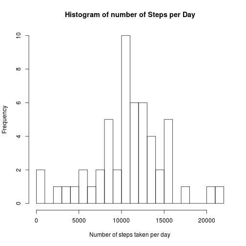

## Loading and preprocessing the data

### Load data

```r
unzip('activity.zip')
suppressMessages(library(data.table))
dat <- fread('activity.csv', header=TRUE)
```

### Transform data

```r
suppressMessages(library(dplyr))
dat <- mutate(dat, date=as.POSIXct(date))
```


## What is mean total number of steps taken per day?
### Total number of steps taken per day

```r
dat1 <- dat[!is.na(dat$steps),]
steps_per_day <- aggregate(select(dat1, steps),
                            by=list(date=dat1$date), FUN=sum)
hist(steps_per_day$steps, breaks=20,
        main='Histogram of number of Steps per Day',
        xlab='Number of steps taken per day',
        ylab='Frequency')
```

 

### Mean of the total number of steps taken perday

```r
as.integer(mean(steps_per_day$steps))
```

```
## [1] 10766
```

### Median of the total number of steps taken perday

```r
as.integer(median(steps_per_day$steps))
```

```
## [1] 10765
```


## What is the average daily activity pattern?

### Average number of steps taken every interval, averaged across all days

```r
avgsteps_per_interval <- aggregate(select(dat1, steps),
                                    by=list(interval=dat1$interval), FUN=mean)
plot(avgsteps_per_interval$steps ~ avgsteps_per_interval$interval, type='l',
        main='Average Number of Steps Taken During the Day',
        ylab='Steps', xlab='Time of Day', xaxt='n')
axis(1, at=(0:6*4)*100, labels=paste(0:6*4, ':00', sep=''))
```

 

### Which 5-min interval on average across all the days contains the maximum number of steps?

```r
max_interval <- avgsteps_per_interval$interval[
                    which.max(avgsteps_per_interval$steps)]
max_interval 
```

```
## [1] 835
```

### At what time?

```r
sprintf('%02d:%02d', floor(max_interval/100), max_interval%%100*0.6)
```

```
## [1] "08:21"
```


## Imputing missing values


## Are there differences in activity patterns between weekdays and weekends?
